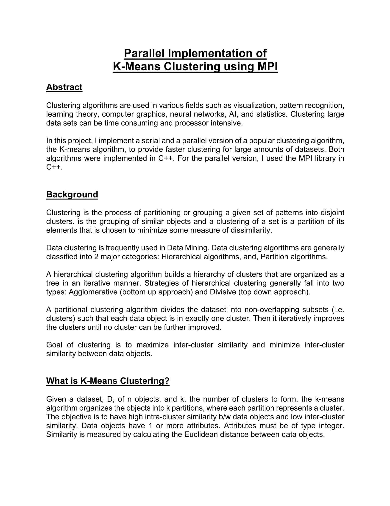
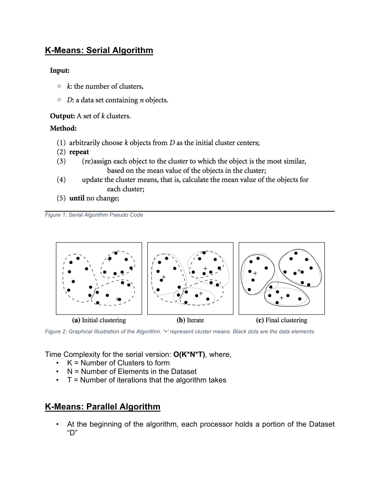
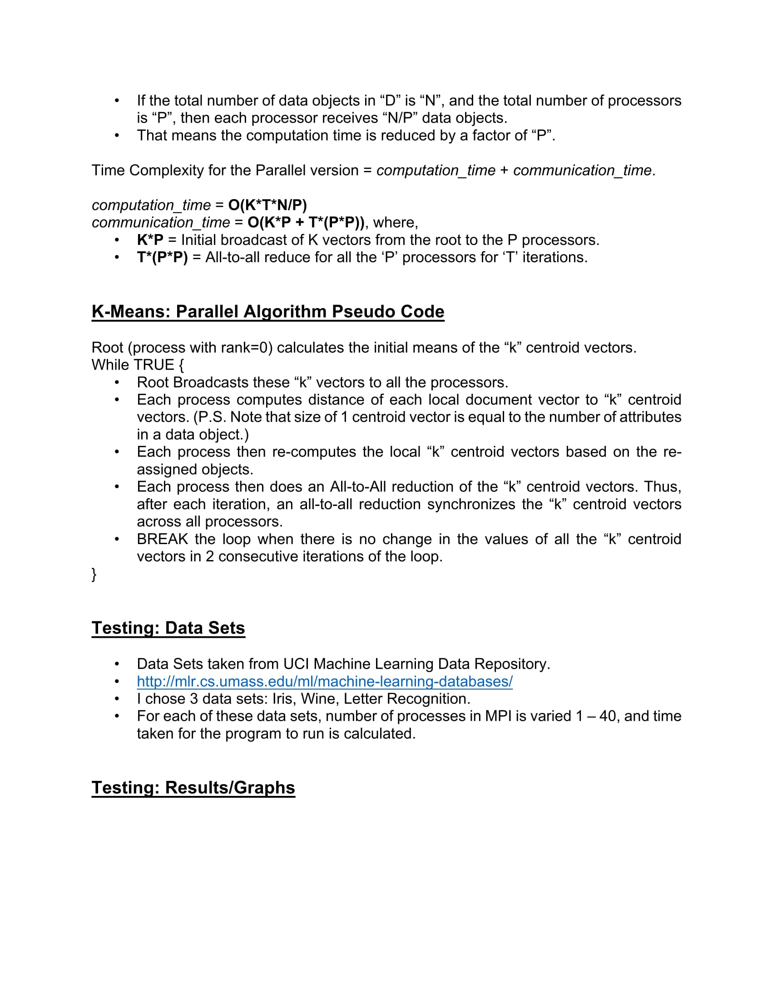
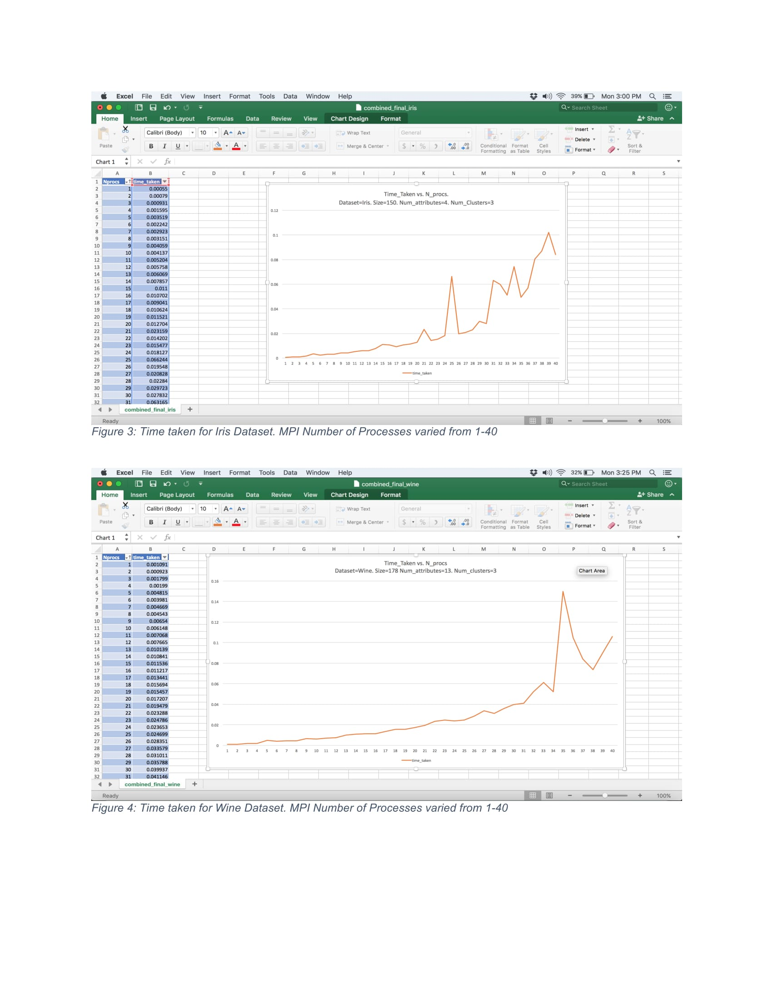
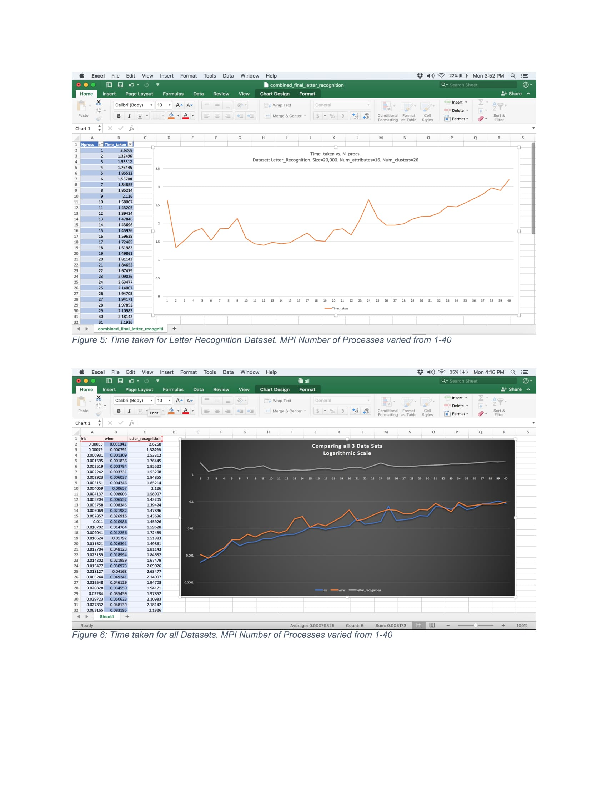
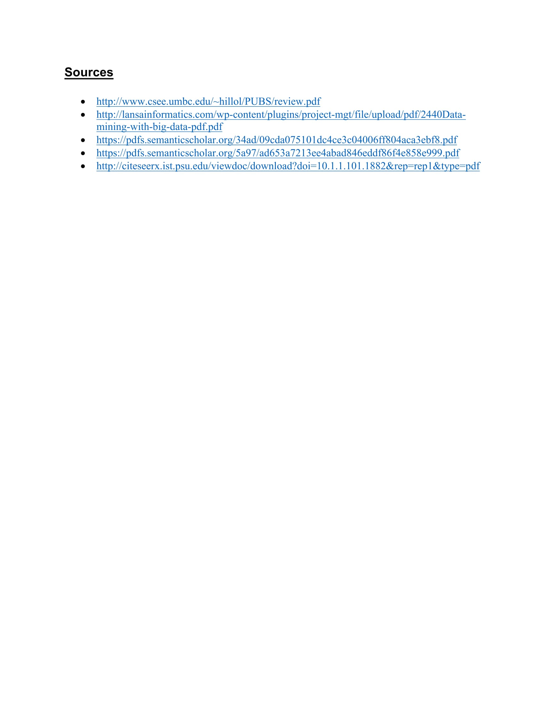

# Parallel Implementation of K Means Clustering Algorithm using Message Passing Paradigm (MPI) in C++

To run the parallel code for various number of threads, go to the Code directory and run the bash file:
```
$ bash bash.sh
```

To run the serial code:

```
$ g++ serial.cpp -o serial

$ ./serial
```
# Project Report












